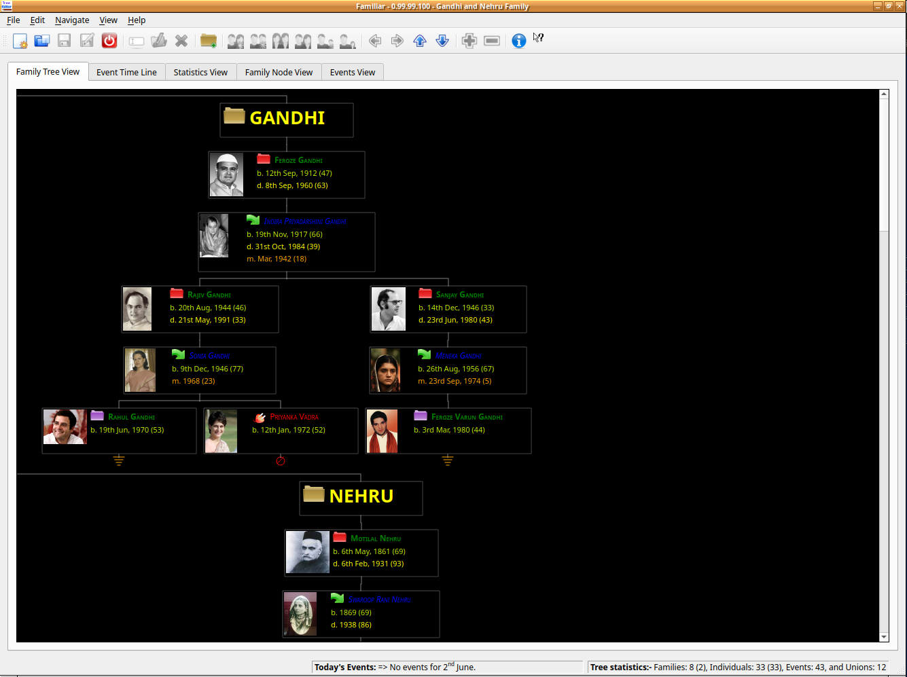
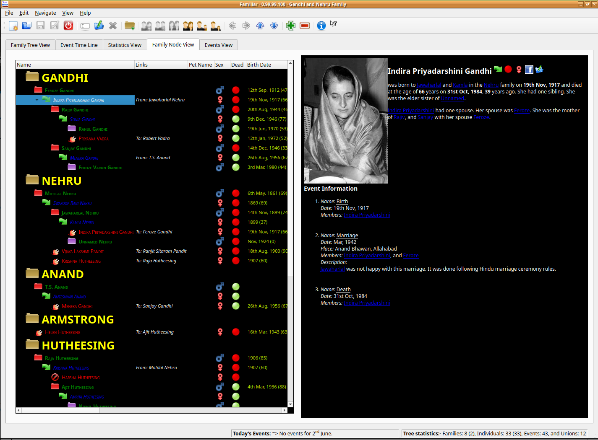
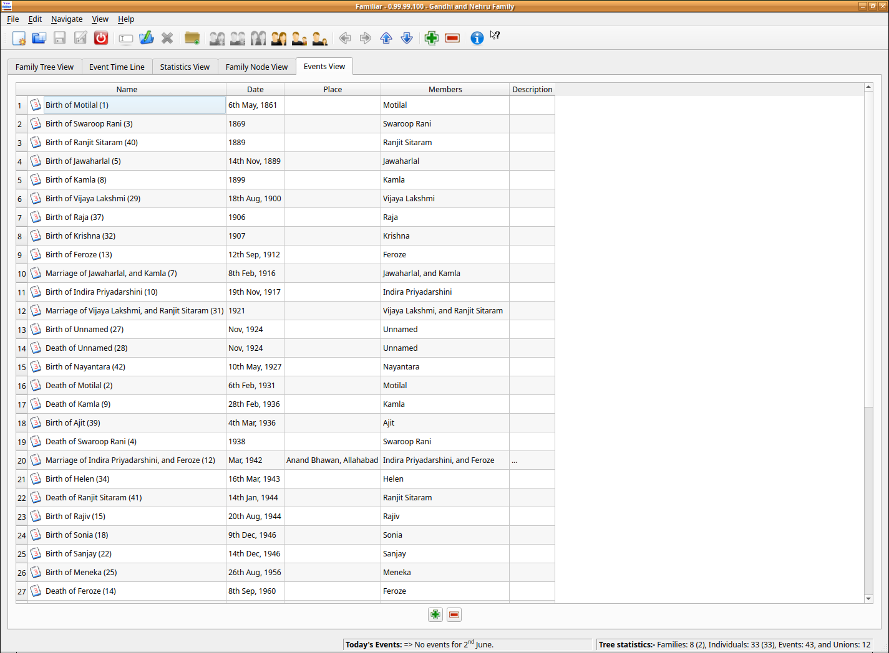
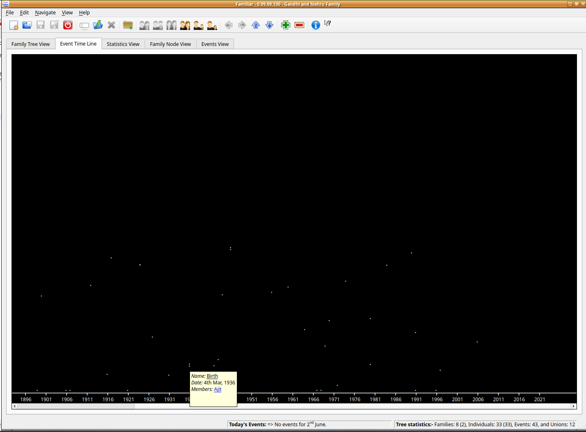

<!-- Improved compatibility of back to top link: See: https://github.com/othneildrew/Best-README-Template/pull/73 -->

<!--
*** Thanks for checking out the Best-README-Template. If you have a suggestion
*** that would make this better, please fork the repo and create a pull request
*** or simply open an issue with the tag "enhancement".
*** Don't forget to give the project a star!
*** Thanks again! Now go create something AMAZING! :D
-->

<!-- PROJECT SHIELDS -->
<!--
*** I'm using markdown "reference style" links for readability.
*** Reference links are enclosed in brackets [ ] instead of parentheses ( ).
*** See the bottom of this document for the declaration of the reference variables
*** for contributors-url, forks-url, etc. This is an optional, concise syntax you may use.
*** https://www.markdownguide.org/basic-syntax/#reference-style-links
-->
[![Contributors][contributors-shield]][contributors-url]
[![Forks][forks-shield]][forks-url]
[![Stargazers][stars-shield]][stars-url]
[![Issues][issues-shield]][issues-url]
[![MIT License][license-shield]][license-url]
[![LinkedIn][linkedin-shield]][linkedin-url]

<!-- TABLE OF CONTENTS -->

  
Table of Contents

  <ol>
    <li>
      <a href="#about-the-project">About The Project</a>
      <ul>
        <li><a href="#built-with">Built With</a></li>
      </ul>
    </li>
    <li>
      <a href="#getting-started">Getting Started</a>
      <ul>
        <li><a href="#prerequisites">Prerequisites</a></li>
        <li><a href="#installation">Installation</a></li>
      </ul>
    </li>
    <li><a href="#usage">Usage</a></li>
    <li><a href="#license">License</a></li>
    <li><a href="#contact">Contact</a></li>
  </ol>

<!-- ABOUT THE PROJECT -->
## About The Project

Familiar is (traditional) Family Tree (Genealogy) Software based on QT's model/view architecture. It supports family tree creation in an "intuitive" manner. Also it supports displaying data in various different formats and views.

It is available for both UNIX and Windows. All you require is QT5. It has an a series of very good user interfaces - Family and hierarchical tree, timeline and event list. The best part is the data is stored as xml and it exports a good .ged record. 

(<a href="#readme-top">back to top</a>)

### Built With

* [![QT5][Qt5]][Qt5-url]

(<a href="#readme-top">back to top</a>)

<!-- GETTING STARTED -->
## Getting Started

This is an example of how you may give instructions on setting up your project locally.
To get a local copy up and running follow these simple example steps.

### Prerequisites

Familiar requires QT >= 4.7. Better still install and use QT5.

### Installation

To install Familiar please execute the following commands:

1. qmake
2. make
3. make install

Step (3) might require root privileges.

Note: Familiar requires QT >= 4.7

(<a href="#readme-top">back to top</a>)

<!-- USAGE EXAMPLES -->
## Usage

Some screenshots of Familiar:

(<a href="#readme-top">back to top</a>)

<!-- LICENSE -->
## License

Distributed under the GNU GPL version 3. See `LICENSE` for more information.

(<a href="#readme-top">back to top</a>)

<!-- CONTACT -->
## Contact

Project Link: [https://github.com/homebackend/familiar](https://github.com/homebackend/familiar)

(<a href="#readme-top">back to top</a>)

(<a href="#readme-top">back to top</a>)

<!-- MARKDOWN LINKS & IMAGES -->
<!-- https://www.markdownguide.org/basic-syntax/#reference-style-links -->
[contributors-shield]: https://img.shields.io/github/contributors/homebackend/familiar.svg?style=for-the-badge
[contributors-url]: https://github.com/homebackend/familiar/graphs/contributors
[forks-shield]: https://img.shields.io/github/forks/homebackend/familiar.svg?style=for-the-badge
[forks-url]: https://github.com/homebackend/familiar/network/members
[stars-shield]: https://img.shields.io/github/stars/homebackend/familiar.svg?style=for-the-badge
[stars-url]: https://github.com/homebackend/familiar/stargazers
[issues-shield]: https://img.shields.io/github/issues/homebackend/familiar.svg?style=for-the-badge
[issues-url]: https://github.com/homebackend/familiar/issues
[license-shield]: https://img.shields.io/github/license/homebackend/familiar.svg?style=for-the-badge
[license-url]: https://github.com/homebackend/familiar/blob/master/LICENSE
[linkedin-shield]: https://img.shields.io/badge/-LinkedIn-black.svg?style=for-the-badge&logo=linkedin&colorB=555
[linkedin-url]: https://linkedin.com/in/neeraj-jakhar-39686212b
[Qt5]: https://doc.qt.io/style/qt-logo-documentation.svg
[Qt5-url]: https://doc.qt.io/qt-5/
